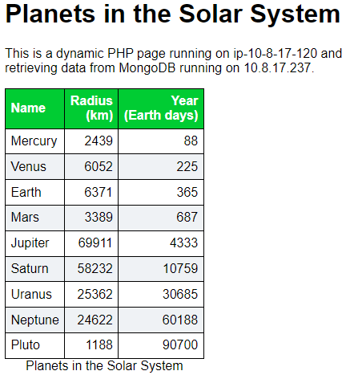

# Demo 09 - Putting it all together

We have used Terraform to stand up a typical collection of systems and Ansible
to configure them. What we haven't done is tied those two together into a single
step. Because showing this has some additional requirements and
permissions, I am going to run this as a demonstration from my laptop.

To make our system more realistic, I'll put a load balancer in place in front
of the web servers. Other than that, I'll just repeat the
[previous lesson](../lesson-08/README.md), but add in the pieces to run
Terraform and Ansible together. 

I have prepared a video of these steps to accompany the descriptions below if
you want to see them in action. I regularly update the demonstration, so the
video might be for an older version and it may not match exactly.

* [demo-09 video](https://youtu.be/S4MeMONH5Cw)

## Preparing my laptop

I've [installed Ansible](https://docs.ansible.com/ansible/latest/installation_guide/intro_installation.html)
locally. I'll also need to install the Ansible roles and collections locally as
well, since they were only on our control node before.

* [geerlingguy.nginx](https://galaxy.ansible.com/geerlingguy/nginx) role
* [geerlingguy.php](https://galaxy.ansible.com/geerlingguy/php) role
* [community.mongodb](https://galaxy.ansible.com/community/mongodb) collection

```console
$ ansible-galaxy install geerlingguy.nginx
...
- geerlingguy.nginx (3.1.4) was installed successfully

$ ansible-galaxy install geerlingguy.php
...
- geerlingguy.php (5.0.0) was installed successfully

$ ansible-galaxy collection install community.mongodb
Process install dependency map
Starting collection install process
Installing 'community.mongodb:1.6.0' to '/home/ggotimer/.ansible/collections/ansible_collections/community/mongodb'
Installing 'ansible.posix:1.5.4' to '/home/ggotimer/.ansible/collections/ansible_collections/ansible/posix'
Installing 'community.general:7.0.1' to '/home/ggotimer/.ansible/collections/ansible_collections/community/general'
```

Since Ansible will need to `ssh` from the local system to the systems in AWS,
I'll configure the SSH key I was using on the control node to be my default key.

```console
$ eval $(ssh-agent)
Agent pid 7953

$ ssh-add /home/ggotimer/.ssh/gene-test-us-east-2.pem
Identity added: /home/ggotimer/.ssh/gene-test-us-east-2.pem (/home/ggotimer/.ssh/gene-test-us-east-2.pem)

$ ssh-add -l
2048 SHA256:BdmxwBiUP11ZL1X1Qw6M3st8k7nWVGWkNCIpj3vhkmc /home/ggotimer/.ssh/gene-test-us-east-2.pem (RSA)
```

Terraform was always running locally, so there isn't anything extra to prepare
for this demo.

## Run it all

This demonstration will take about 10 minutes to complete, so I'll kick it off
first and then describe the important changes.

```console
$ terraform init
...

$ terraform apply
...
Do you want to perform these actions?
  Terraform will perform the actions described above.
  Only 'yes' will be accepted to approve.

  Enter a value: yes
...
```

That's it. And it is actually vital that is *all* we need to do. A prime benefit
of using these tools and infrastructure-as-code in general is making our jobs
automated and therefore repeatable and reliable. And they can't very well meet
those expectations if there are a bunch of manual steps.

## Major changes

There are a few changes in this lesson that should be explained.

### SSH access from laptop

In [Lesson 04](../lesson-04/README.md), we set up SSH access from the internet
to the control node for us and then from the control node to the target web servers
and database for Ansible. If I am running Ansible from my laptop, I'll need to
open SSH access to all the target systems.

Opening SSH from the internet in general to these systems is more open than I am
comfortable with. So in [network.tf](network.tf), I use the `http` provisioner
in Terraform to get my current public IP address from <https://ifconfig.me/>.
When I set up the security groups for SSH, each only allows access from my
current address. And if I move to a new IP address I can just `terraform apply`
again to modify the security group to allow access only from my new address.

### Load balancer

We set up two web servers in the previous Ansible lessons. There isn't much real
world value in that unless we had a load balancer in front of them to distribute
the load between them.

Setting up a load balancer is a little tedious, setting up:

* the application load balancer (ALB) instance in multiple availability zones
* security groups into the ALB
* security groups from the ALB to the target systems
* the group of target systems (target group)
* the ALB listener for the port to a target group

The example code in [load-balancer.tf](load-balancer.tf) takes some significant
shortcuts, but it is a good starting point. The HTTP listeners should redirect
to HTTPS and host all traffic there. There should be a web application firewall
(WAF) protecting the ALB from attack. The ALB is available in multiple
availability zones (AZs), but there should be web servers and databases in those
AZs as well for true resiliency. The ALB should have logging and deletion
protection turned on.

Feel free to use it as a starting point, but remember it is just a starting
point.

### Tagging

We tagged all our instances and most resources earlier, but it was just for
reference before. Now, it will take on some strong purpose.

```terraform
  tags = {
    Name        = "planet-mongodb"
    Project     = "planets"
    Environment = "demo"
    Role        = "database"
    Owner       = var.owner_email
  }
```

If we look at the database tags, we see the `Name` and `Owner` as before. Those
are good practice. But we've hard-coded the `Project` (it was a variable before),
and added `Environment` and `Role`. The names and values are up to us, but
almost everyone will need something along these lines.

We are going to generate our Ansible inventory based on the `Project` and
`Environment`, using the `Role` tag to name the groups for Ansible.

### Dynamic inventory

Here is where the changes start getting really interesting.

Our old inventory looked like:

```ini
[workstation]
10.8.0.26

[targets]
10.8.0.10
10.8.0.41
10.8.0.178

[all:children]
workstation
targets

[webserver]
10.8.0.41
10.8.0.178

[database]
10.8.0.10
```

Particularly important to Ansible were the `webserver` and `database` groups.
For each of the playbooks we used, `nginx-playbook.yml` and `mongodb-playbook.yml`,
we ran them against our entire system and let the playbook pattern (i.e., the `hosts`
line) determine what systems to target.

For example, `mongodb-playbook.yml` starts with:

```yaml
---
- hosts: database
```

so it targeted `10.8.0.10`. That's convenient, since we can point our playbooks
at all of our servers and just let each playbook sort out which servers to run
against.

Our problem is that the IP addresses were determined when Terraform ran. So we
needed to look at the output, set up our inventory file, and then run Ansible.

With the tagging we've added and a *dynamic inventory plugin* we can let Ansible
query our AWS account using the same credentials we set up for Terraform. Since
it queries our entire AWS account, not limited to the systems that Terraform
just stood up, we will filter out only the systems in the `Project` and
`Environment` we are applying Ansible to. And then we will use the `Role` tag as
the key for our groups.

I created [inventory-aws_ec2.yml](inventory-aws_ec2.yml) with those filters and
grouping instructions. (The file name was up to me, as long as it ended with
`aws_ec2.yml` or `aws_ec2.yaml`.)

```yaml
---
plugin: aws_ec2

regions:
  - us-east-2

hostnames:
  - ip-address

filters:
  tag:Project: planets
  tag:Environment: demo

keyed_groups:
  - key: tags.Role
    separator: ''
  - key: tags.Environment
    prefix: env
```

Since I am using this from my laptop, the IP addresses will be the public addresses
rather than the private ones. Also, we can't just look at a file to see the results
since this is truly dynamic. No file is written out- the plugin determines the
inventory at runtime. Instead, I can run a command to see a representation of
the current inventory.

```console
$ ansible-inventory -i inventory-aws_ec2.yml --graph
@all:
  |--@aws_ec2:
  |  |--18.220.32.12
  |  |--18.221.23.189
  |  |--3.145.43.100
  |--@database:
  |  |--3.145.43.100
  |--@env_demo:
  |  |--18.220.32.12
  |  |--18.221.23.189
  |  |--3.145.43.100
  |--@ungrouped:
  |--@webserver:
  |  |--18.220.32.12
  |  |--18.221.23.189
```

The `@` symbols are just part of the graph representation, not part of the group
names.

For my use, this generates the same group names (`database` and `webserver`) as
we used in the previous lesson. As such I can use the playbooks exactly as they
were.

The [aws_ec2
inventory](https://docs.ansible.com/ansible/latest/collections/amazon/aws/aws_ec2_inventory.html)
plugin has many options. Also, the [playbook
patterns](https://docs.ansible.com/ansible/latest/user_guide/intro_patterns.html#common-patterns)
can be more than just a single group. With a well-planned tagging strategy, a
single inventory plugin configuration could take care of your entire AWS
ecosystem, making it easy to target the right servers for any project in any
environment. For exmaple, `env_demo:&webserver` for web servers in the `demo`
environment. Or `database:!env_prod` for databases not in the `prod` enviroment,
if we had such an environment and had not filtered it out.

### local-exec

Now that we've handled the inventory using automation, we just need to call
Ansible once Terraform is finished. We could just wrap the Terraform and Ansible
commands in a shell script, but there is a more flexible and elegant way.

At the end of [main.tf](main.tf), I added a resource with a call to the
`local-exec` provider.

```terraform
resource "null_resource" "ansible" {
  provisioner "local-exec" {
    command = "ANSIBLE_HOST_KEY_CHECKING=false ansible-playbook --inventory inventory-aws_ec2.yml --user ubuntu site.yml"
  }

  triggers = {
    always_run = timestamp()
  }

  depends_on = [
    aws_instance.webserver,
    aws_instance.mongodb
  ]
}
```

The `null_resource` is handled by Terraform like any other resource, except it
has no action until we give it one. The `local-exec` runs locally on my laptop,
as opposed to a `remote-exec` which runs on the resource. We used the
`remote-exec` to bootstrap Ansible on our control node in [Lesson 04](../lesson-04/README.md).

The `triggers` argument tells Terraform when this resource needs to run or not.
In this case, as long as the time changes the provisioner will run. That might
seem anti-idempotent, but as long as our Ansible code is idempotent itself,
calling it each time is cleaner than jumping through hoops to determine if one
of the resources and/or playbooks changed. Plus, if someone or something makes
a change on one of the systems, Ansible will figure out that it needs to reapply
the configuration.

The `depends_on` argument tells Terraform that I need those resources built
before this resource is applied. Most of the time Terraform figures that out on
its own, but with the `null_resource` we need to explicitly spell it out.
Ansible needs the webserver and database EC2 instances, so I'll call them out
as dependencies.

The Ansible command line looks a little more involved than we used before, but
it is really just putting the options from the `ansible.cfg` directly into the
command. That way I don't have to rely on a local configuration file.

The last change is the [site.yml](site.yml) playbook.

```yaml
---
- hosts: all
  gather_facts: false
  become: true

  tasks:
  - name: Wait 600 seconds for targets to become reachable/usable
    ansible.builtin.wait_for_connection:
  - name: Update repositories caches
    ansible.builtin.apt:
      update_cache: yes

- import_playbook: nginx-playbook.yml
- import_playbook: mongodb-playbook.yml
```

It imports the two playbooks we used before so that I can call them from one
place. But before it invokes them, it waits until the target systems are responding
until it kicks them off. That way the Ansible commands don't start running until
the system is ready. Internally, `wait_for_connection` relies on the 
`ping` module we used earlier. By default, it will wait for up to 10 minutes
(600 seconds) until it times out. This playbook also forces an update to the
package repository cache on each system, to make sure the following playbooks
can find any packages they need.

## Results

The result of my single `terraform apply` is that all three systems plus a
load balancer was stood up and Ansible configured the web servers and the
database.

```console
$ terraform apply
...
Outputs:

planets_url = "http://planet20220519132008987000000001-1532753543.us-east-2.elb.amazonaws.com/"
webserver_private_ips = [
  "10.8.17.120",
  "10.8.18.228",
]
webserver_public_ips = [
  "18.220.32.12",
  "18.221.23.189",
]
```

When I point a browser to that long, unwieldy URL, I see the same planets demo
as before, with the addition of Pluto just so I can see a difference.

<kbd>
  
</kbd>

If I hit this URL from multiple locations, we could see the private IP address
for the webserver change between the two web servers, thanks to the load balancer.

## Shortcuts taken

As mentioned earlier, there are some shortcuts in this demo. Before using it as
an example for a production system, remember that this was a demonstration.

An easy way to see some of the IaC shortcuts is to look at the warnings that
were suppressed from Checkov:

```console
$ checkov -d .
...
Check: CKV_AWS_91: "Ensure the ELBv2 (Application/Network) has access logging enabled"
        SKIPPED for resource: aws_lb.webserver_alb
        Suppress comment: No logging since it is a demo- not good for production
        File: /load-balancer.tf:53-72
Check: CKV_AWS_150: "Ensure that Load Balancer has deletion protection enabled"
        SKIPPED for resource: aws_lb.webserver_alb
        Suppress comment: Allow deletion since it is a demo- not good for production
        File: /load-balancer.tf:53-72
Check: CKV_AWS_2: "Ensure ALB protocol is HTTPS"
        SKIPPED for resource: aws_alb_listener.webservers_http
        Suppress comment: HTTP only for demo- not good for production
        File: /load-balancer.tf:93-104
Check: CKV_AWS_103: "Ensure that load balancer is using TLS 1.2"
        SKIPPED for resource: aws_alb_listener.webservers_http
        Suppress comment: HTTP only for demo- not good for production
        File: /load-balancer.tf:93-104
Check: CKV_AWS_88: "EC2 instance should not have public IP."
        SKIPPED for resource: aws_instance.webserver
        Suppress comment: Allowing public access for Ansible
        File: /main.tf:21-51
Check: CKV_AWS_88: "EC2 instance should not have public IP."
        SKIPPED for resource: aws_instance.mongodb
        Suppress comment: Allowing public access for Ansible
        File: /main.tf:53-82
Check: CKV2_AWS_11: "Ensure VPC flow logging is enabled in all VPCs"
        SKIPPED for resource: aws_vpc.sandbox_vpc
        Suppress comment: Skipping logging to make permissions easier- not a generally good idea
        File: /network.tf:24-33
Check: CKV2_AWS_20: "Ensure that ALB redirects HTTP requests into HTTPS ones"
        SKIPPED for resource: aws_lb.webserver_alb
        Suppress comment: HTTP only for demo- not good for production
        File: /load-balancer.tf:53-72
Check: CKV2_AWS_28: "Ensure public facing ALB are protected by WAF"
        SKIPPED for resource: aws_lb.webserver_alb
        Suppress comment: No WAF since it is a demo- not good for production
        File: /load-balancer.tf:53-72
```

In many cases, the [Bridgecrew documentation](https://docs.bridgecrew.io/docs)
will describe how to fix the issue if you just search for the Checkov finding ID.
But often those fixes will introduce new issues that need to be resolved. It isn't
endless, but making sure you have covered all the recommended practices can be
tedious, which is why we use tools to check our code and ensure we haven't missed
anything.

## Clean up

When we are done, we can clean up the environment as usual.
From our laptop:

```console
$ terraform destroy
```

## End of Demo 09

This is the final lesson, *at least for now*.

# Terraform documentation

<!-- BEGIN_TF_DOCS -->
## Requirements

| Name | Version |
|------|---------|
| <a name="requirement_terraform"></a> [terraform](#requirement\_terraform) | >= 1.5.0 |
| <a name="requirement_aws"></a> [aws](#requirement\_aws) | ~> 5.2.0 |
| <a name="requirement_http"></a> [http](#requirement\_http) | ~> 3.3.0 |
| <a name="requirement_null"></a> [null](#requirement\_null) | ~> 3.2.1 |

## Providers

| Name | Version |
|------|---------|
| <a name="provider_aws"></a> [aws](#provider\_aws) | ~> 5.2.0 |
| <a name="provider_http"></a> [http](#provider\_http) | ~> 3.3.0 |
| <a name="provider_null"></a> [null](#provider\_null) | ~> 3.2.1 |

## Modules

No modules.

## Resources

| Name | Type |
|------|------|
| [aws_alb_listener.webservers_http](https://registry.terraform.io/providers/hashicorp/aws/latest/docs/resources/alb_listener) | resource |
| [aws_default_security_group.default](https://registry.terraform.io/providers/hashicorp/aws/latest/docs/resources/default_security_group) | resource |
| [aws_instance.mongodb](https://registry.terraform.io/providers/hashicorp/aws/latest/docs/resources/instance) | resource |
| [aws_instance.webserver](https://registry.terraform.io/providers/hashicorp/aws/latest/docs/resources/instance) | resource |
| [aws_internet_gateway.sandbox_gateway](https://registry.terraform.io/providers/hashicorp/aws/latest/docs/resources/internet_gateway) | resource |
| [aws_lb.webserver_alb](https://registry.terraform.io/providers/hashicorp/aws/latest/docs/resources/lb) | resource |
| [aws_lb_target_group.webservers](https://registry.terraform.io/providers/hashicorp/aws/latest/docs/resources/lb_target_group) | resource |
| [aws_lb_target_group_attachment.webserver](https://registry.terraform.io/providers/hashicorp/aws/latest/docs/resources/lb_target_group_attachment) | resource |
| [aws_route_table.rtb_public](https://registry.terraform.io/providers/hashicorp/aws/latest/docs/resources/route_table) | resource |
| [aws_route_table_association.rta_subnet_public](https://registry.terraform.io/providers/hashicorp/aws/latest/docs/resources/route_table_association) | resource |
| [aws_security_group.alb_sg](https://registry.terraform.io/providers/hashicorp/aws/latest/docs/resources/security_group) | resource |
| [aws_security_group.mongodb_sg](https://registry.terraform.io/providers/hashicorp/aws/latest/docs/resources/security_group) | resource |
| [aws_security_group.webserver_sg](https://registry.terraform.io/providers/hashicorp/aws/latest/docs/resources/security_group) | resource |
| [aws_security_group_rule.alb_sg_allow_http](https://registry.terraform.io/providers/hashicorp/aws/latest/docs/resources/security_group_rule) | resource |
| [aws_security_group_rule.alb_sg_allow_http_to_webservers](https://registry.terraform.io/providers/hashicorp/aws/latest/docs/resources/security_group_rule) | resource |
| [aws_security_group_rule.alb_sg_allow_https](https://registry.terraform.io/providers/hashicorp/aws/latest/docs/resources/security_group_rule) | resource |
| [aws_security_group_rule.alb_sg_allow_https_to_webservers](https://registry.terraform.io/providers/hashicorp/aws/latest/docs/resources/security_group_rule) | resource |
| [aws_security_group_rule.mongodb_sg_allow_all_outgoing](https://registry.terraform.io/providers/hashicorp/aws/latest/docs/resources/security_group_rule) | resource |
| [aws_security_group_rule.mongodb_sg_allow_ansible_ssh](https://registry.terraform.io/providers/hashicorp/aws/latest/docs/resources/security_group_rule) | resource |
| [aws_security_group_rule.mongodb_sg_allow_webserver_mongodb](https://registry.terraform.io/providers/hashicorp/aws/latest/docs/resources/security_group_rule) | resource |
| [aws_security_group_rule.webserver_sg_allow_all_outgoing](https://registry.terraform.io/providers/hashicorp/aws/latest/docs/resources/security_group_rule) | resource |
| [aws_security_group_rule.webserver_sg_allow_ansible_ssh](https://registry.terraform.io/providers/hashicorp/aws/latest/docs/resources/security_group_rule) | resource |
| [aws_security_group_rule.webserver_sg_allow_http](https://registry.terraform.io/providers/hashicorp/aws/latest/docs/resources/security_group_rule) | resource |
| [aws_security_group_rule.webserver_sg_allow_https](https://registry.terraform.io/providers/hashicorp/aws/latest/docs/resources/security_group_rule) | resource |
| [aws_subnet.public_subnet](https://registry.terraform.io/providers/hashicorp/aws/latest/docs/resources/subnet) | resource |
| [aws_vpc.sandbox_vpc](https://registry.terraform.io/providers/hashicorp/aws/latest/docs/resources/vpc) | resource |
| [null_resource.ansible](https://registry.terraform.io/providers/hashicorp/null/latest/docs/resources/resource) | resource |
| [aws_ami.ubuntu_focal](https://registry.terraform.io/providers/hashicorp/aws/latest/docs/data-sources/ami) | data source |
| [aws_availability_zone.all](https://registry.terraform.io/providers/hashicorp/aws/latest/docs/data-sources/availability_zone) | data source |
| [aws_availability_zones.available](https://registry.terraform.io/providers/hashicorp/aws/latest/docs/data-sources/availability_zones) | data source |
| [http_http.ifconfig_co_ip](https://registry.terraform.io/providers/hashicorp/http/latest/docs/data-sources/http) | data source |

## Inputs

| Name | Description | Type | Default | Required |
|------|-------------|------|---------|:--------:|
| <a name="input_aws_profile"></a> [aws\_profile](#input\_aws\_profile) | Local AWS profile to use for AWS credentials | `string` | `"default"` | no |
| <a name="input_aws_region"></a> [aws\_region](#input\_aws\_region) | AWS region to build in | `string` | n/a | yes |
| <a name="input_az_number"></a> [az\_number](#input\_az\_number) | n/a | `map` | <pre>{<br>  "a": 1,<br>  "b": 2,<br>  "c": 3,<br>  "d": 4,<br>  "e": 5,<br>  "f": 6<br>}</pre> | no |
| <a name="input_key_name"></a> [key\_name](#input\_key\_name) | Name of an already-installed AWS keypair | `string` | n/a | yes |
| <a name="input_owner_email"></a> [owner\_email](#input\_owner\_email) | Email address to tag resources with | `string` | n/a | yes |
| <a name="input_planet_az"></a> [planet\_az](#input\_planet\_az) | Availability zone to run the demo in | `string` | `"us-east-2a"` | no |

## Outputs

| Name | Description |
|------|-------------|
| <a name="output_planets_url"></a> [planets\_url](#output\_planets\_url) | URL for the planets demo |
| <a name="output_webserver_private_ips"></a> [webserver\_private\_ips](#output\_webserver\_private\_ips) | Private IP addresses of the NGINX webservers |
| <a name="output_webserver_public_ips"></a> [webserver\_public\_ips](#output\_webserver\_public\_ips) | Public IP addresses of the NGINX webservers |
<!-- END_TF_DOCS -->
