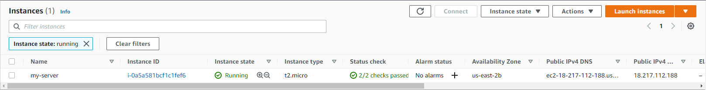

# Lesson 01 - Terraform basics

## Hello world

Start by creating an EC2 instance using Terraform.

```terraform
resource "aws_instance" "my_server" {
  ami           = "ami-0629230e074c580f2"
  instance_type = "t2.micro"

  tags = {
    Name = "my-server"
  }
}
```

```console
$ ls -A
.gitignore  README.md  main.tf
$ terraform init

Initializing the backend...

Initializing provider plugins...
- Finding hashicorp/aws versions matching "~> 3.65"...
- Installing hashicorp/aws v3.65.0...
- Installed hashicorp/aws v3.65.0 (signed by HashiCorp)

Terraform has created a lock file .terraform.lock.hcl to record the provider
selections it made above. Include this file in your version control repository
so that Terraform can guarantee to make the same selections by default when
you run "terraform init" in the future.

Terraform has been successfully initialized!

You may now begin working with Terraform. Try running "terraform plan" to see
any changes that are required for your infrastructure. All Terraform commands
should now work.

If you ever set or change modules or backend configuration for Terraform,
rerun this command to reinitialize your working directory. If you forget, other
commands will detect it and remind you to do so if necessary.
$ terraform validate
Success! The configuration is valid.

$ terraform apply

Terraform used the selected providers to generate the following execution plan. Resource actions are indicated with the following symbols:
  + create

Terraform will perform the following actions:

  # aws_instance.my_server will be created
  + resource "aws_instance" "my_server" {
...

Plan: 1 to add, 0 to change, 0 to destroy.

Do you want to perform these actions?
  Terraform will perform the actions described above.
  Only 'yes' will be accepted to approve.

  Enter a value: yes

aws_instance.my_server: Creating...
aws_instance.my_server: Still creating... [10s elapsed]
aws_instance.my_server: Still creating... [20s elapsed]
aws_instance.my_server: Still creating... [30s elapsed]
aws_instance.my_server: Creation complete after 33s [id=i-0a5a581bcf1c1fef6]

Apply complete! Resources: 1 added, 0 changed, 0 destroyed.
```

The EC2 instance is created in AWS.



## See what we have created

We don't have look at the AWS Console to see the details, though.

```console
$ ls -A
.gitignore  .terraform  .terraform.lock.hcl  README.md  main.tf  terraform.tfstate  terraform.tfstate.backup
$ less terraform.tfstate
{
  "version": 4,
  "terraform_version": "1.0.11",
...

$ terraform show
# aws_instance.my_server:
resource "aws_instance" "my_server" {
    ami                                  = "ami-0629230e074c580f2"
...

$ terraform state list
aws_instance.my_server
$ terraform state show "aws_instance.my_server"
# aws_instance.my_server:
resource "aws_instance" "my_server" {
    ami                                  = "ami-0629230e074c580f2"
...
```

## Make a simple change

We can make a simple change to the instance, just update the value of the `Name`
tag.

```terraform
resource "aws_instance" "my_server" {
  ami           = "ami-0629230e074c580f2"
  instance_type = "t2.micro"

  tags = {
    Name = "tf-lesson-01"
  }
}
```

```console
$ terraform apply
aws_instance.my_server: Refreshing state... [id=i-0a5a581bcf1c1fef6]

Terraform used the selected providers to generate the following execution plan. Resource actions are indicated with the following symbols:
  ~ update in-place

Terraform will perform the following actions:

  # aws_instance.my_server will be updated in-place
  ~ resource "aws_instance" "my_server" {
        id                                   = "i-0a5a581bcf1c1fef6"
      ~ tags                                 = {
          ~ "Name" = "my-server" -> "tf-lesson-01"
        }
      ~ tags_all                             = {
          ~ "Name" = "my-server" -> "tf-lesson-01"
        }
        # (27 unchanged attributes hidden)


        # (5 unchanged blocks hidden)
    }

Plan: 0 to add, 1 to change, 0 to destroy.

Do you want to perform these actions?
  Terraform will perform the actions described above.
  Only 'yes' will be accepted to approve.

  Enter a value: yes

aws_instance.my_server: Modifying... [id=i-0a5a581bcf1c1fef6]
aws_instance.my_server: Modifications complete after 1s [id=i-0a5a581bcf1c1fef6]

Apply complete! Resources: 0 added, 1 changed, 0 destroyed.
```

## Add another server

We can also do something more complex, like increasing the number of servers.

```terraform
resource "aws_instance" "my_server" {
  count         = 2
  ami           = "ami-0629230e074c580f2"
  instance_type = "t2.micro"

  tags = {
    Name = "tf-lesson-01-${count.index}"
  }
}
```

```console
$ terraform apply
aws_instance.my_server[0]: Refreshing state... [id=i-0a5a581bcf1c1fef6]
...

Terraform used the selected providers to generate the following execution plan. Resource actions are indicated with the following symbols:
  + create
  ~ update in-place

Terraform will perform the following actions:

  # aws_instance.my_server[0] will be updated in-place
  ~ resource "aws_instance" "my_server" {
        id                                   = "i-0a5a581bcf1c1fef6"
      ~ tags                                 = {
          ~ "Name" = "tf-lesson-01" -> "tf-lesson-01-0"
        }
      ~ tags_all                             = {
          ~ "Name" = "tf-lesson-01" -> "tf-lesson-01-0"
        }
        # (27 unchanged attributes hidden)


        # (5 unchanged blocks hidden)
    }

  # aws_instance.my_server[1] will be created
  + resource "aws_instance" "my_server" {
      + ami                                  = "ami-0629230e074c580f2"
...

Plan: 1 to add, 1 to change, 0 to destroy.

Do you want to perform these actions?
  Terraform will perform the actions described above.
  Only 'yes' will be accepted to approve.

  Enter a value: yes

aws_instance.my_server[1]: Creating...
aws_instance.my_server[0]: Modifying... [id=i-0a5a581bcf1c1fef6]
aws_instance.my_server[0]: Modifications complete after 2s [id=i-0a5a581bcf1c1fef6]
aws_instance.my_server[1]: Still creating... [10s elapsed]
aws_instance.my_server[1]: Still creating... [20s elapsed]
aws_instance.my_server[1]: Still creating... [30s elapsed]
aws_instance.my_server[1]: Still creating... [40s elapsed]
aws_instance.my_server[1]: Creation complete after 43s [id=i-055c6c695256a4a3f]

Apply complete! Resources: 1 added, 1 changed, 0 destroyed.
```

We can still see what was created by Terraform using the command-line.

```console
$ terraform state list
aws_instance.my_server[0]
aws_instance.my_server[1]
$ terraform state show "aws_instance.my_server[0]"
# aws_instance.my_server[0]:
resource "aws_instance" "my_server" {
    ami                                  = "ami-0629230e074c580f2"
...
```

## Clean up

We can clean up what we created since we don't need it anymore.

```console
$ terraform destroy
aws_instance.my_server[0]: Refreshing state... [id=i-0a5a581bcf1c1fef6]
aws_instance.my_server[1]: Refreshing state... [id=i-055c6c695256a4a3f]

Terraform used the selected providers to generate the following execution plan. Resource actions are indicated with the following symbols:
  - destroy

Terraform will perform the following actions:

  # aws_instance.my_server[0] will be destroyed
  - resource "aws_instance" "my_server" {
      - ami                                  = "ami-0629230e074c580f2" -> null
...
  # aws_instance.my_server[1] will be destroyed
  - resource "aws_instance" "my_server" {
      - ami                                  = "ami-0629230e074c580f2" -> null
...
Plan: 0 to add, 0 to change, 2 to destroy.

Do you really want to destroy all resources?
  Terraform will destroy all your managed infrastructure, as shown above.
  There is no undo. Only 'yes' will be accepted to confirm.

  Enter a value: yes

aws_instance.my_server[0]: Destroying... [id=i-0a5a581bcf1c1fef6]
aws_instance.my_server[1]: Destroying... [id=i-055c6c695256a4a3f]
aws_instance.my_server[1]: Still destroying... [id=i-055c6c695256a4a3f, 10s elapsed]
aws_instance.my_server[0]: Still destroying... [id=i-0a5a581bcf1c1fef6, 10s elapsed]
aws_instance.my_server[0]: Still destroying... [id=i-0a5a581bcf1c1fef6, 20s elapsed]
aws_instance.my_server[1]: Still destroying... [id=i-055c6c695256a4a3f, 20s elapsed]
aws_instance.my_server[1]: Still destroying... [id=i-055c6c695256a4a3f, 30s elapsed]
aws_instance.my_server[0]: Still destroying... [id=i-0a5a581bcf1c1fef6, 30s elapsed]
aws_instance.my_server[1]: Destruction complete after 30s
aws_instance.my_server[0]: Still destroying... [id=i-0a5a581bcf1c1fef6, 40s elapsed]
aws_instance.my_server[0]: Destruction complete after 41s

Destroy complete! Resources: 2 destroyed.
```

End of Lesson 01.
