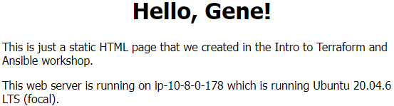

# Lesson 07 - Practical Ansible

*Except where noted, these instructions should be run on the Ansible workstation
(i.e., control node) we stood up in Lesson 04.*

Often the applications we are deploying involve than just one system. And the
packages we deploy usually need some custom configuration, defining directories
and permissions, or pointing a web application to the database backend, for example.

## Web application architecture

A typical web application might involve a pair of load-balanced web servers with
a database backend. For our purposes, we'll skip the load balancer and use
two of our three targets as [NGINX](https://www.nginx.com/) web servers.
The remaining target will be a [MongoDB](https://www.mongodb.com/) database server.

Update the `inventory.ini` to add these groups so we can refer to the servers easily.

```ini
[workstation]
10.8.0.137

[targets]
10.8.0.87
10.8.0.115
10.8.0.128

[all:children]
workstation
targets

[webservers]
10.8.0.115
10.8.0.128

[database]
10.8.0.87
```

Test them with a `ping`.

```console
ubuntu@ip-10-8-0-137:~$ ansible webservers -m ping
10.8.0.115 | SUCCESS => {
    "ansible_facts": {
        "discovered_interpreter_python": "/usr/bin/python3"
    },
    "changed": false,
    "ping": "pong"
}
10.8.0.128 | SUCCESS => {
    "ansible_facts": {
        "discovered_interpreter_python": "/usr/bin/python3"
    },
    "changed": false,
    "ping": "pong"
}
ubuntu@ip-10-8-0-137:~$ ansible database -m ping
10.8.0.87 | SUCCESS => {
    "ansible_facts": {
        "discovered_interpreter_python": "/usr/bin/python3"
    },
    "changed": false,
    "ping": "pong"
}
```

## Ansible Galaxy

Installing NGINX and MongoDB is a little more involved than installing a single
package each as we did with `fortune` and `cowsay`. Fortunately, both are popular
software and someone else has already come up with code we can use. The public
repository for sharing that code is [Ansible Galaxy](https://galaxy.ansible.com/).

The software on Ansible Galaxy is community supported and varies wildly in
quality and capability. It is best to look for code published by Ansible themselves
(listed as `community`), the product owners (e.g., `nginxinc`) or popular items
(e.g., anything published by `geerlingguy`).

We will use the [geerlingguy.nginx](https://galaxy.ansible.com/geerlingguy/nginx) role
and the [community.mongodb](https://galaxy.ansible.com/community/mongodb) collection.
The Galaxy pages have information on how to use them.
First, we need to install them on our control node so Ansible can use them.

```console
ubuntu@ip-10-8-0-137:~$ ansible-galaxy install geerlingguy.nginx
Starting galaxy role install process
- downloading role 'nginx', owned by geerlingguy
- downloading role from https://github.com/geerlingguy/ansible-role-nginx/archive/3.1.0.tar.gz
- extracting geerlingguy.nginx to /home/ubuntu/.ansible/roles/geerlingguy.nginx
- geerlingguy.nginx (3.1.0) was installed successfully
ubuntu@ip-10-8-0-137:~$ ansible-galaxy collection install community.mongodb
Starting galaxy collection install process
Process install dependency map
Starting collection install process
Downloading https://galaxy.ansible.com/download/community-mongodb-1.3.2.tar.gz to /home/ubuntu/.ansible/tmp/ansible-local-26740snolbke_/tmpnvmry8al/community-mongodb-1.3.2-anci_mrg
Installing 'community.mongodb:1.3.2' to '/home/ubuntu/.ansible/collections/ansible_collections/community/mongodb'
Downloading https://galaxy.ansible.com/download/ansible-posix-1.3.0.tar.gz to /home/ubuntu/.ansible/tmp/ansible-local-26740snolbke_/tmpnvmry8al/ansible-posix-1.3.0-hq9o9l_3
community.mongodb:1.3.2 was installed successfully
Installing 'ansible.posix:1.3.0' to '/home/ubuntu/.ansible/collections/ansible_collections/ansible/posix'
Downloading https://galaxy.ansible.com/download/community-general-4.2.0.tar.gz to /home/ubuntu/.ansible/tmp/ansible-local-26740snolbke_/tmpnvmry8al/community-general-4.2.0-eg2d5mt0
ansible.posix:1.3.0 was installed successfully
Installing 'community.general:4.2.0' to '/home/ubuntu/.ansible/collections/ansible_collections/community/general'
community.general:4.2.0 was installed successfully
```

## Installing NGINX

The `geerlingguy.nginx` role in an Ansible role, which is a package of at least
tasks and metadata code, and could include more code collected into
[standard directories](https://docs.ansible.com/ansible/latest/user_guide/playbooks_reuse_roles.html#id2).

```
playbook.yml
roles/
  rolename/
    tasks/
    handlers/
    library/
    files/
    templates/
    vars/
    defaults/
    meta/
```

We don't have to worry about that right now since `geerlingguy` already did. We
just have to supply the playbook.

Create `nginx-playbook.yml` on the control node to call the role. We want the
role applied to our `webservers` group. Since we'll be installing packages,
we'll need elevated privileges. The Read Me shows which variables to supply and
then we can leave the rest to the role.

```yaml
---
- hosts: webservers
  become: true

  vars:
    nginx_vhosts:
      - listen: "80"
        server_name: "example.com"

  roles:
    - {role: geerlingguy.nginx}
```

Then run our playbook.

```console
ubuntu@ip-10-8-0-137:~$ ansible-playbook nginx-playbook.yml

PLAY [webservers] ******************************************************************************************************************

TASK [Gathering Facts] *************************************************************************************************************
ok: [10.8.0.115]
ok: [10.8.0.128]

TASK [geerlingguy.nginx : Include OS-specific variables.] **************************************************************************
ok: [10.8.0.115]
ok: [10.8.0.128]

TASK [geerlingguy.nginx : Define nginx_user.] **************************************************************************************
ok: [10.8.0.115]
ok: [10.8.0.128]

TASK [geerlingguy.nginx : include_tasks] *******************************************************************************************
skipping: [10.8.0.115]
skipping: [10.8.0.128]

TASK [geerlingguy.nginx : include_tasks] *******************************************************************************************
included: /home/ubuntu/.ansible/roles/geerlingguy.nginx/tasks/setup-Ubuntu.yml for 10.8.0.115, 10.8.0.128

TASK [geerlingguy.nginx : Ensure dirmngr is installed (gnupg dependency).] *********************************************************
ok: [10.8.0.115]
ok: [10.8.0.128]

TASK [geerlingguy.nginx : Add PPA for Nginx (if configured).] **********************************************************************
skipping: [10.8.0.115]
skipping: [10.8.0.128]

TASK [geerlingguy.nginx : Ensure nginx will reinstall if the PPA was just added.] **************************************************
skipping: [10.8.0.115]
skipping: [10.8.0.128]

TASK [geerlingguy.nginx : include_tasks] *******************************************************************************************
included: /home/ubuntu/.ansible/roles/geerlingguy.nginx/tasks/setup-Debian.yml for 10.8.0.115, 10.8.0.128

TASK [geerlingguy.nginx : Update apt cache.] ***************************************************************************************
ok: [10.8.0.115]
ok: [10.8.0.128]

TASK [geerlingguy.nginx : Ensure nginx is installed.] ******************************************************************************
changed: [10.8.0.115]
changed: [10.8.0.128]

TASK [geerlingguy.nginx : include_tasks] *******************************************************************************************
skipping: [10.8.0.115]
skipping: [10.8.0.128]

TASK [geerlingguy.nginx : include_tasks] *******************************************************************************************
skipping: [10.8.0.115]
skipping: [10.8.0.128]

TASK [geerlingguy.nginx : include_tasks] *******************************************************************************************
skipping: [10.8.0.115]
skipping: [10.8.0.128]

TASK [geerlingguy.nginx : Remove default nginx vhost config file (if configured).] *************************************************
skipping: [10.8.0.115]
skipping: [10.8.0.128]

TASK [geerlingguy.nginx : Ensure nginx_vhost_path exists.] *************************************************************************
ok: [10.8.0.115]
ok: [10.8.0.128]

TASK [geerlingguy.nginx : Add managed vhost config files.] *************************************************************************
changed: [10.8.0.115] => (item={'listen': '80', 'server_name': 'example.com'})
changed: [10.8.0.128] => (item={'listen': '80', 'server_name': 'example.com'})

TASK [geerlingguy.nginx : Remove managed vhost config files.] **********************************************************************
skipping: [10.8.0.115] => (item={'listen': '80', 'server_name': 'example.com'})
skipping: [10.8.0.128] => (item={'listen': '80', 'server_name': 'example.com'})

TASK [geerlingguy.nginx : Remove legacy vhosts.conf file.] *************************************************************************
ok: [10.8.0.115]
ok: [10.8.0.128]

TASK [geerlingguy.nginx : Copy nginx configuration in place.] **********************************************************************
changed: [10.8.0.115]
changed: [10.8.0.128]

TASK [geerlingguy.nginx : Ensure nginx service is running as configured.] **********************************************************
ok: [10.8.0.115]
ok: [10.8.0.128]

RUNNING HANDLER [geerlingguy.nginx : reload nginx] *********************************************************************************
changed: [10.8.0.115]
changed: [10.8.0.128]

PLAY RECAP *************************************************************************************************************************
10.8.0.115                 : ok=12   changed=4    unreachable=0    failed=0    skipped=9    rescued=0    ignored=0
10.8.0.128                 : ok=12   changed=4    unreachable=0    failed=0    skipped=9    rescued=0    ignored=0
```

We need to find out what the public IP addresses for the targets are, knowing
that 2 of the 3 of them are our webservers.

On our laptop, go to the `lesson-04` directory and pull up the Terraform output again.

```console
$ cd ../lesson-04
$ terraform output target_public_ips
target_public_ips = [
  "18.217.223.87",
  "18.219.179.242",
  "52.14.207.168",
]
```

If we point a web browser to those IP addresses, we should see a webpage on 2 of them.


That works, but we really want something a little more bespoke. We can add some
more configuration to the playbook and include a new home page. Add another variable
and a task to `nginx-playbook.yml`.

```yaml
---
- hosts: webservers
  become: true

  vars:
    my_name: "Gene"
    nginx_vhosts:
      - listen: "80"
        server_name: "example.com"

  roles:
    - {role: geerlingguy.nginx}

  tasks:
    - name: Install a custom home page
      template:
        src: index.html.j2
        dest: /var/www/html/index.html
        mode: 0644
```

The [template](https://docs.ansible.com/ansible/latest/collections/ansible/builtin/template_module.html)
module uses Jinja2 to create a new home page for us. We need to create the
`index.html.j2` template on the control node as well.

```html
<!DOCTYPE html>
<html lang="en" xml:lang="en">
<head>
    <title>Hello, {{ my_name }}!</title>
    <style>
        body {
            width: 35em;
            margin: 0 auto;
            font-family: Tahoma, Verdana, Arial, sans-serif;
        }
    </style>
</head>

<body>
<h1 align="center">Hello, {{ my_name }}!</h1>

<p>This is just a static HTML page that we created in the
    Intro to Terraform and Ansible workshop.</p>

<p>This web server is running on {{ ansible_hostname }} which is
    running {{ ansible_lsb.description }} ({{ ansible_lsb.codename }}).
</body>
</html>
```

This time when we run the playbook, we see that the new task was executed and it
was the only play that changed. The rest of the plays were idempotent.

```console
ubuntu@ip-10-8-0-137:~$ ansible-playbook nginx-playbook.yml

PLAY [webservers] ******************************************************************************************************************
...
TASK [Install a custom home page] **************************************************************************************************
changed: [10.8.0.128]
changed: [10.8.0.115]

PLAY RECAP *************************************************************************************************************************
10.8.0.115                 : ok=14   changed=1    unreachable=0    failed=0    skipped=8    rescued=0    ignored=0
10.8.0.128                 : ok=14   changed=1    unreachable=0    failed=0    skipped=8    rescued=0    ignored=0
```



## Installing MongoDB

## End of Lesson 07
