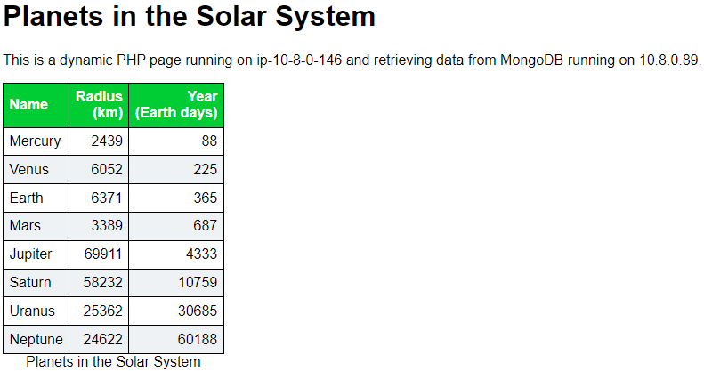

# Lesson 08 - Full web application

*Except where noted, these instructions should be run on the Ansible workstation
(i.e., control node) we stood up in [Lesson 04](../lesson-04/README.md).
Run that lesson now, if needed.*

Building upon the previous lesson, we are going to install and configure NGINX
on two of our target servers and MongoDB on the other. We will load data into
the database and install a simple web page to look up data from that database we
just initialized.

## Prepare the Ansible resources

Since we are still running Ansible from our control node, we need to copy the
files on to that system.

* [nginx-playbook.yml](./nginx-playbook.yml) - playbook to set up the web servers
* [index.php.j2](./index.php.j2) - templated PHP page
* [planets.css](./planets.css) - style sheet for the PHP page
* [mongodb-playbook.yml](./mongodb-playbook.yml) - playbook to set up the database
* [mongodb-admin.js](./mongodb-admin.js) - admin user for the database
* [mongodb-data.js](./mongodb-data.js) - initial data for the database

We also need to install an additional Ansible role,
[geerlingguy.php](https://galaxy.ansible.com/geerlingguy/php) to install PHP and
set up NGINX to use PHP-FPM.

```console
ubuntu@ip-10-8-0-26:~$ ansible-galaxy install geerlingguy.php
Starting galaxy role install process
- downloading role 'php', owned by geerlingguy
- downloading role from https://github.com/geerlingguy/ansible-role-php/archive/5.0.0.tar.gz
- extracting geerlingguy.php to /home/ubuntu/.ansible/roles/geerlingguy.php
- geerlingguy.php (5.0.0) was installed successfully
```

## Run the Ansible code

All we have to do now is run the Ansible code on each of the groups.

```console
ubuntu@ip-10-8-0-26:~$ ansible-playbook nginx-playbook.yml

PLAY [Gather facts from database group] ********************************************************************************************

TASK [Gathering Facts] *************************************************************************************************************
ok: [10.8.0.10]

PLAY [Build a PHP web site] ********************************************************************************************************
...

PLAY RECAP *************************************************************************************************************************
10.8.0.178                 : ok=54   changed=17   unreachable=0    failed=0    skipped=16   rescued=0    ignored=0
10.8.0.41                  : ok=54   changed=17   unreachable=0    failed=0    skipped=16   rescued=0    ignored=0
10.8.0.10                  : ok=1    changed=0    unreachable=0    failed=0    skipped=0    rescued=0    ignored=0

ubuntu@ip-10-8-0-26:~$ ansible-playbook mongodb-playbook.yml

PLAY [Install, configure, and populate mongodb] ************************************************************************************
...
PLAY RECAP *************************************************************************************************************************
10.8.0.10                  : ok=33   changed=8    unreachable=0    failed=0    skipped=10   rescued=0    ignored=0
```

If we point a web browser at either of our web servers, we should see our
PHP web page.

<kbd>
  
</kbd>

## Clean up

When we are done, we can clean up the environment we created back in lesson-04.
From our laptop:

```console
$ cd ../lesson-04
$ terraform destroy
```

## End of Lesson 08

Now we just need to [demonstrate it all working together](../demo-09/README.md).
